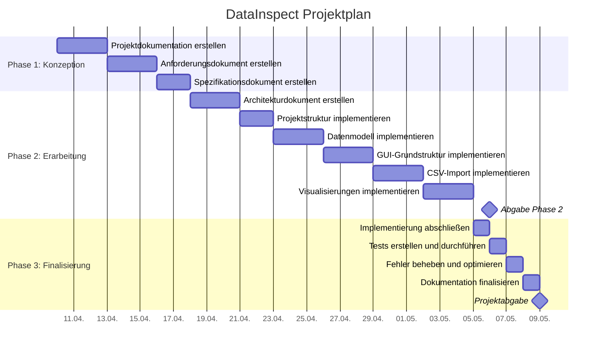

# Projektdokumentation „DataInspect"

## Projektübersicht

### Projektziel
Das Projekt "DataInspect" zielt auf die Entwicklung einer benutzerfreundlichen Desktop-Anwendung, die es Nutzern ermöglicht, Daten aus verschiedenen Quellen zu importieren, grundlegende Datenvorverarbeitungen durchzuführen und die Daten durch interaktive Visualisierungen zu analysieren und präsentieren. Die Anwendung soll eine intuitive Benutzeroberfläche bieten und verschiedene Diagrammtypen unterstützen, die anpassbar sind und als Bild oder PDF exportiert werden können.

### Projektumfang
1. **Datenimport:** Import von Daten aus CSV-, Excel- und JSON-Dateien.
2. **Datenvorverarbeitung:** Grundlegende Datenbereinigung, einfache Transformationen und Berechnung von Statistiken.
3. **Visualisierung:** Verschiedene Diagrammtypen (Balken, Linien, Kreis, Streudiagramm, Heatmap) mit Anpassungsmöglichkeiten und interaktiven Elementen.
4. **Export und Sharing:** Export als Bild oder PDF sowie Speichern von Projekten zur späteren Bearbeitung.
5. **Benutzeroberfläche:** Intuitive, benutzerfreundliche Oberfläche mit Drag-and-Drop-Funktionalität und Vorlagen für gängige Diagrammtypen.

---

## Risikomanagement

### Risiko 1: Zeitdruck
- **Beschreibung:** Das Projekt muss innerhalb von 19 Tagen abgeschlossen werden, mit Ostern (18.-21. April) in der Mitte der Entwicklungsphase.
- **Eintrittswahrscheinlichkeit:** Hoch (5/5)
- **Auswirkung:** Hoch (5/5)
- **Gegenmaßnahmen:**
  - Erstellung eines detaillierten Zeitplans mit klaren Prioritäten
  - Fokus auf Kernfunktionen und MVP (Minimum Viable Product)
  - Modularer Entwicklungsansatz, um Funktionen bei Bedarf weglassen zu können
  - Bereitstellung von Extra-Arbeitszeit vor und nach Ostern

### Risiko 2: Technische Komplexität
- **Beschreibung:** Die Integration verschiedener Bibliotheken (PyQt, Matplotlib, Pandas) könnte zu Kompatibilitätsproblemen oder unerwarteten Herausforderungen führen.
- **Eintrittswahrscheinlichkeit:** Mittel (3/5)
- **Auswirkung:** Hoch (4/5)
- **Gegenmaßnahmen:**
  - Frühe Erstellung eines technischen Prototyps zur Validierung des Konzepts
  - Verwendung bewährter, gut dokumentierter Bibliotheken
  - Einplanung von Zeit für technische Recherche und Problemlösung
  - Backup-Plan mit alternativen Bibliotheken bei Kompatibilitätsproblemen

### Risiko 3: Umfangserweiterung
- **Beschreibung:** Die Versuchung, zusätzliche Features zu implementieren, könnte zu Verzögerungen führen.
- **Eintrittswahrscheinlichkeit:** Mittel (3/5)
- **Auswirkung:** Mittel (3/5)
- **Gegenmaßnahmen:**
  - Klare Definition des MVP
  - Priorisierung von Features und strikte Einhaltung der Prioritätenliste
  - Zeitpuffer für unvorhergesehene Probleme einplanen
  - Regelmäßige Überprüfung des Projektfortschritts

### Risiko 4: Begrenzte GUI-Erfahrung
- **Beschreibung:** Möglicherweise begrenzte Erfahrung mit PyQt könnte zu einer ineffizienten Implementierung der Benutzeroberfläche führen.
- **Eintrittswahrscheinlichkeit:** Mittel (3/5)
- **Auswirkung:** Mittel (3/5)
- **Gegenmaßnahmen:**
  - Recherche und Nutzung von Best-Practice-Beispielen
  - Fokus auf Funktionalität vor Ästhetik
  - Frühe Prototypen der GUI zur Validierung des Konzepts

---

## Zeitplanung

### Detaillierte Zeitplanung mit Dauern und Pufferzeiten

Die folgende Tabelle zeigt die detaillierte Zeitplanung für das DataInspect-Projekt mit konkreten Dauern für jeden Vorgang und eingeplanten Pufferzeiten zur Risikominimierung.

| Phase | Arbeitspaket | Geplante Dauer | Pufferzeit | Gesamtdauer | Zeitraum |
|-------|--------------|----------------|------------|-------------|----------|
| **Phase 1: Konzeptionsphase** | | | | **7 Tage** | **10.04. - 16.04.** |
| | Projektdokumentation erstellen | 2 Tage | 0,5 Tage | 2,5 Tage | 10.04. - 12.04. |
| | Anforderungsdokument erstellen | 2 Tage | 0,5 Tage | 2,5 Tage | 12.04. - 14.04. |
| | Spezifikationsdokument erstellen | 1,5 Tage | 0,5 Tage | 2 Tage | 14.04. - 16.04. |
| **Phase 2: Erarbeitungs- und Reflexionsphase** | | | | **14 Tage** | **16.04. - 30.04.** |
| | Architekturdokument erstellen | 2 Tage | 0,5 Tage | 2,5 Tage | 16.04. - 18.04. |
| | Projektstruktur und Grundgerüst implementieren | 1 Tag | 0,5 Tage | 1,5 Tage | 18.04. - 19.04. |
| | Datenmodell implementieren | 2 Tage | 1 Tag | 3 Tage | 19.04. - 22.04. |
| | GUI-Grundstruktur implementieren | 2 Tage | 1 Tag | 3 Tage | 22.04. - 25.04. |
| | CSV-Import und Datenvorverarbeitung implementieren | 2 Tage | 1 Tag | 3 Tage | 25.04. - 28.04. |
| | Visualisierungskomponenten implementieren | 1,5 Tage | 1 Tag | 2,5 Tage | 28.04. - 30.04. |
| **Phase 3: Finalisierungsphase** | | | | **8 Tage** | **30.04. - 08.05.** |
| | Implementierung abschließen | 1 Tag | 0,5 Tage | 1,5 Tage | 30.04. - 01.05. |
| | Tests erstellen und durchführen | 1,5 Tage | 0,5 Tage | 2 Tage | 01.05. - 03.05. |
| | Fehler beheben und Optimierungen vornehmen | 1 Tag | 1 Tag | 2 Tage | 03.05. - 05.05. |
| | Dokumentation finalisieren | 1,5 Tage | 0,5 Tage | 2 Tage | 05.05. - 07.05. |
| | Abschließende Tests und Abgabe vorbereiten | 0,5 Tage | 0 Tage | 0,5 Tage | 08.05. |

### Grafische Darstellung des Vorgehens



**Abbildung 1:** Gantt-Diagramm des Projektplans für DataInspect mit den verschiedenen Phasen und Arbeitspaketen.

### Erläuterung der Pufferzeiten

Die Pufferzeiten wurden basierend auf einer Risikoanalyse für jeden Vorgang eingeplant:

1. **Dokumentationsphasen (0,5 Tage Puffer):**
   - Geringeres Risiko, da hauptsächlich textbasierte Arbeit
   - Mögliche Verzögerungen durch Klärungsbedarf oder Überarbeitungen

2. **Implementierungsphasen (1 Tag Puffer):**
   - Höheres Risiko aufgrund technischer Komplexität
   - Mögliche Verzögerungen durch unvorhergesehene technische Herausforderungen
   - Besonders kritisch bei neuen Technologien (GUI, Visualisierungen)

3. **Fehlerkorrektur (1 Tag Puffer):**
   - Hohe Unsicherheit bezüglich der Anzahl und Komplexität gefundener Fehler
   - Flexibilität für gründliche Qualitätssicherung

Die Gesamtpufferzeit beträgt 8,5 Tage, was etwa 30% der Netto-Projektdauer entspricht. Diese Verteilung ermöglicht eine flexible Reaktion auf Verzögerungen, ohne den Gesamtzeitplan zu gefährden.

### Meilensteine

| Meilenstein | Geplantes Datum | Beschreibung |
|-------------|----------------|--------------|
| M1: Abschluss Konzeptionsphase | 16.04.2023 | Alle Dokumente für Phase 1 fertiggestellt |
| M2: Grundlegende Implementierung | 25.04.2023 | Datenmodell und GUI-Grundstruktur implementiert |
| M3: Funktionale Anwendung | 30.04.2023 | Alle Kernfunktionalitäten implementiert |
| M4: Qualitätssicherung | 06.05.2023 | Tests abgeschlossen, kritische Fehler behoben, Abgabe Phase 2 |
| M5: Projektabschluss | 08.05.2023 | Finale Dokumentation fertiggestellt |
| M6: Projektabgabe | 09.05.2023 | Abgabe des finalen Projekts |

---

## Projektfortschritt und Abweichungen

### Abweichungen vom Zeitplan
Die Implementierung hat sich gegenüber dem ursprünglichen Zeitplan um etwa eine Woche verzögert. Dies ist auf folgende Faktoren zurückzuführen:

1. **Technische Herausforderungen:** Die Integration der Column-Klasse in die Dataset-Struktur erwies sich als komplexer als erwartet, insbesondere bei der Serialisierung von NumPy-Datentypen für die JSON-Speicherung.

2. **Architekturanpassungen:** Die Umstellung auf eine strikte 1:1-Beziehung zwischen DataSource und Dataset sowie die hierarchische Struktur für Visualisierungen erforderten umfangreichere Änderungen am Datenmodell als ursprünglich geplant.

3. **Testaufwand:** Die Implementierung robuster Tests für die neuen Komponenten nahm mehr Zeit in Anspruch als vorgesehen.

### Gegenmaßnahmen
Um trotz der Verzögerungen das Projekt erfolgreich abzuschließen, wurden folgende Maßnahmen ergriffen:

1. **Fokussierung auf Kernfunktionalitäten:** Priorisierung der wichtigsten Features (Datenimport, grundlegende Visualisierungen) vor optionalen Funktionen.

2. **Erhöhter Zeitaufwand:** Zusätzliche Entwicklungszeit wurde investiert, um den Rückstand aufzuholen.

3. **Vereinfachung einiger Komponenten:** Weniger kritische Funktionen wurden vereinfacht, um Zeit zu sparen.

### Aktueller Stand
Trotz der Verzögerungen konnten die Kernfunktionalitäten erfolgreich implementiert werden:

- CSV-Import mit umfangreichen Konfigurationsoptionen und Transformationen
- Integration der Column-Klasse für verbesserte Datenanalyse
- Hierarchische Struktur für DataSource, Dataset und Visualization
- Grundlegende Visualisierungsfunktionen mit mehreren Diagrammtypen (Balken, Linien, Kreis, Streu, Heatmap)
- Visualisierungserstellung mit Vorschau und Konfigurationsoptionen

Folgende Funktionalitäten sind für die nächste Phase geplant:

- Export von Visualisierungen als Bild oder PDF
- Excel- und JSON-Import
- Erweiterte Filterung, Sortierung und Gruppierung von Daten
- Interaktive Elemente für Visualisierungen

Das GitHub-Repository ist unter [https://github.com/jurkat/datainspect](https://github.com/jurkat/datainspect) verfügbar.

---

## Benutzeranleitung

### Installation und Ausführung

#### Systemvoraussetzungen

- **Betriebssystem:** Windows 10/11, macOS oder Linux
- **Python:** Version 3.12 (gemäß pyrightconfig.json)
- **Festplattenspeicher:** Ca. 100 MB freier Speicherplatz für die Anwendung und Abhängigkeiten
- **Arbeitsspeicher:** Mindestens 4 GB RAM empfohlen
- **Bildschirmauflösung:** Mindestens 1280 x 720 Pixel

#### Installationsschritte

##### Installation für macOS/Linux

1. Klonen Sie das Repository:
   ```bash
   git clone https://github.com/jurkat/datainspect.git
   cd datainspect
   ```

2. Führen Sie das Installations-Skript aus:
   ```bash
   sh setup.sh
   ```

3. Aktivieren Sie die virtuelle Umgebung:
   ```bash
   source venv/bin/activate
   ```

##### Installation für Windows

1. Klonen Sie das Repository:
   ```cmd
   git clone https://github.com/jurkat/datainspect.git
   cd datainspect
   ```

2. Führen Sie das Installations-Skript aus:
   ```cmd
   setup.bat
   ```

3. Aktivieren Sie die virtuelle Umgebung:
   ```cmd
   venv\Scripts\activate.bat
   ```

#### Ausführung

Nach der Installation und Aktivierung der virtuellen Umgebung kann die Anwendung gestartet werden mit:

```bash
python main.py
```

Für den Debug-Modus können Sie die Umgebungsvariable `DATAINSPECT_DEBUG` setzen:

- Unter macOS/Linux:
  ```bash
  DATAINSPECT_DEBUG=1 python main.py
  ```

- Unter Windows:
  ```cmd
  set DATAINSPECT_DEBUG=1
  python main.py
  ```

Nach dem Start wird der Startbildschirm angezeigt, von dem aus Sie ein neues Projekt erstellen oder ein bestehendes öffnen können.

### Grundlegende Funktionen

#### Benutzeroberfläche

Die Benutzeroberfläche von DataInspect besteht aus mehreren Hauptbereichen:

##### Startbildschirm
- **Neues Projekt:** Erstellt ein neues, leeres Projekt
- **Projekt öffnen:** Öffnet ein bestehendes Projekt aus einer .dinsp-Datei
- **Drop-Zone:** Bereich, in den Sie eine Projektdatei ziehen können, um sie zu öffnen

##### Hauptfenster (nach Öffnen eines Projekts)
- **Menüleiste:** Enthält Menüs für Datei, Bearbeiten, Ansicht, Daten, Visualisierung und Hilfe
- **Werkzeugleiste:** Bietet schnellen Zugriff auf häufig verwendete Funktionen
- **Linke Seitenleiste:** Zeigt Projektinformationen und verfügbare Datenquellen an
- **Hauptbereich:** Enthält Tabs für Datenvorschau und Visualisierungen
- **Statusleiste:** Zeigt Informationen zum aktuellen Status der Anwendung

#### Projektmanagement

##### Neues Projekt erstellen
1. Klicken Sie auf der Startseite auf "Neues Projekt" oder wählen Sie im Menü "Datei" > "Neues Projekt"
2. Geben Sie einen Namen für das Projekt ein
3. Klicken Sie auf "Erstellen"

##### Projekt speichern
1. Wählen Sie im Menü "Datei" > "Projekt speichern" oder drücken Sie Strg+S (Cmd+S auf macOS)
2. Wählen Sie einen Speicherort und einen Dateinamen
3. Klicken Sie auf "Speichern"

##### Projekt öffnen
1. Klicken Sie auf der Startseite auf "Projekt öffnen" oder wählen Sie im Menü "Datei" > "Projekt öffnen"
2. Navigieren Sie zur Projektdatei (.dinsp)
3. Klicken Sie auf "Öffnen"

Alternativ können Sie eine Projektdatei auch direkt in die Drop-Zone auf dem Startbildschirm ziehen.

#### Datenimport

##### CSV-Datei importieren
1. Klicken Sie in der linken Seitenleiste auf "Datenquelle hinzufügen" oder wählen Sie im Menü "Daten" > "Datenquelle hinzufügen"
2. Wählen Sie eine CSV-Datei aus
3. Im Import-Dialog können Sie folgende Einstellungen anpassen:
   - **Name:** Name der Datenquelle
   - **Trennzeichen:** Zeichen, das die Spalten trennt (z.B. Komma, Semikolon, Tab)
   - **Kodierung:** Zeichenkodierung der Datei (z.B. UTF-8, ISO-8859-1)
   - **Kopfzeile:** Gibt an, ob die erste Zeile Spaltenüberschriften enthält
   - **Zeilen überspringen:** Anzahl der zu überspringenden Zeilen am Anfang der Datei
   - **Dezimaltrennzeichen:** Zeichen für Dezimalstellen (Punkt oder Komma)
   - **Tausendertrennzeichen:** Zeichen für Tausenderstellen (Punkt oder Komma)
4. Überprüfen Sie die Vorschau der Daten
5. Wechseln Sie zum Tab "Transformationen", um Datenbereinigungen vorzunehmen:
   - Umgang mit fehlenden Werten (Entfernen, Ersetzen)
   - Typkonvertierungen (Text zu Zahl, Datum, etc.)
   - Spaltenumbenennungen
6. Klicken Sie auf "Importieren", um die Daten zu importieren

#### Datenvorverarbeitung

##### Daten anzeigen
1. Klicken Sie in der linken Seitenleiste auf eine Datenquelle
2. Im Hauptbereich wird die Datenvorschau angezeigt
3. Sie können die Daten sortieren, indem Sie auf die Spaltenüberschriften klicken

##### Statistiken anzeigen
1. Wählen Sie eine Datenquelle aus
2. Im Tab "Datenvorschau" werden grundlegende Statistiken für jede Spalte angezeigt:
   - Datentyp
   - Anzahl der Werte
   - Anzahl der fehlenden Werte
   - Minimum und Maximum (für numerische Spalten)
   - Häufigste Werte (für kategoriale Spalten)

#### Visualisierungen

##### Visualisierung erstellen
1. Wählen Sie eine Datenquelle aus
2. Wechseln Sie zum Tab "Visualisierung"
3. Klicken Sie auf "Neue Visualisierung erstellen"
4. Im Dialog "Visualisierung erstellen":
   - Wählen Sie einen Diagrammtyp (Balken, Linie, Kreis, Streu, Heatmap)
   - Geben Sie einen Namen für die Visualisierung ein
   - Wählen Sie im Tab "Daten" die Spalten für die X-Achse und Y-Achse(n)
   - Optional: Konfigurieren Sie im Tab "Filter" Bedingungen zur Einschränkung der angezeigten Daten
   - Überprüfen Sie die Vorschau des Diagramms
5. Klicken Sie auf "OK", um die Visualisierung zu erstellen

##### Visualisierung anzeigen
1. Wählen Sie eine Datenquelle aus
2. Wechseln Sie zum Tab "Visualisierung"
3. Klicken Sie in der Liste auf eine Visualisierung, um sie anzuzeigen

##### Visualisierung bearbeiten
1. Wählen Sie eine Visualisierung aus der Liste
2. Klicken Sie auf das Bearbeiten-Symbol (Stift) neben der Visualisierung
3. Nehmen Sie die gewünschten Änderungen vor
4. Klicken Sie auf "OK", um die Änderungen zu speichern

##### Visualisierung löschen
1. Wählen Sie eine Visualisierung aus der Liste
2. Klicken Sie auf das Löschen-Symbol (Mülleimer) neben der Visualisierung
3. Bestätigen Sie die Löschung

### Fehlerbehebung

#### Häufige Fehler und Lösungen

##### Fehler beim Starten der Anwendung
- **Problem:** Die Anwendung startet nicht oder stürzt beim Start ab
- **Lösung:**
  - Stellen Sie sicher, dass Python 3.12 installiert ist
  - Überprüfen Sie, ob alle Abhängigkeiten korrekt installiert sind
  - Starten Sie die Anwendung im Debug-Modus, um detaillierte Fehlermeldungen zu sehen

##### Fehler beim Importieren von CSV-Dateien
- **Problem:** Die CSV-Datei kann nicht importiert werden oder wird falsch dargestellt
- **Lösung:**
  - Überprüfen Sie das Trennzeichen (Komma, Semikolon, Tab)
  - Überprüfen Sie die Kodierung der Datei (UTF-8, ISO-8859-1)
  - Stellen Sie sicher, dass die Einstellung für die Kopfzeile korrekt ist
  - Überprüfen Sie die Einstellungen für Dezimal- und Tausendertrennzeichen

##### Fehler bei der Visualisierung
- **Problem:** Die Visualisierung wird nicht angezeigt oder enthält Fehler
- **Lösung:**
  - Überprüfen Sie, ob die ausgewählten Spalten den richtigen Datentyp haben
  - Stellen Sie sicher, dass die Daten keine fehlenden Werte enthalten
  - Versuchen Sie, einen anderen Diagrammtyp zu verwenden

#### Support

Bei Problemen oder Fragen können Sie:
- Das GitHub-Repository unter [https://github.com/jurkat/datainspect](https://github.com/jurkat/datainspect) besuchen
- Ein Issue im GitHub-Repository erstellen
- Die Dokumentation im docs/-Verzeichnis konsultieren
