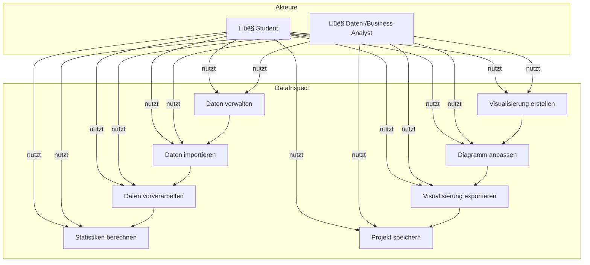

# Anforderungsdokument „DataInspect"

## Stakeholder

### Primäre Zielgruppen
1. **Studierende**
   - Benötigen ein Tool zur Visualisierung von Daten für Projekte, Hausarbeiten und Abschlussarbeiten
   - Haben begrenztes Budget und möchten keine kostenpflichtigen Speziallösungen erwerben
   - Besitzen meist Grundkenntnisse in Datenanalyse, aber nicht unbedingt Programmierkenntnisse
   - Benötigen intuitive Bedienung und schnelle Ergebnisse
   - **Konkrete Anforderungen:**
     - Einfache Installation ohne administrative Rechte
     - Kostenlose Nutzung ohne Lizenzgebühren
     - Unterstützung für gängige Datenformate aus Studienarbeiten (CSV, Excel)
     - Maximale Lernkurve von 30 Minuten für Grundfunktionen
     - Möglichkeit, Visualisierungen in Studienarbeiten zu integrieren (Export-Funktion)
   - **Nutzungskontext:**
     - Datenanalyse für Seminararbeiten und Abschlussarbeiten
     - Visualisierung von Forschungsdaten und Umfrageergebnissen
     - Präsentation von Daten in Vorträgen und Postern

2. **Fachleute in kleinen bis mittleren Unternehmen**
   - Benötigen regelmäßig Datenvisualisierungen für Berichte und Präsentationen
   - Müssen häufig mit verschiedenen Datenquellen arbeiten
   - Legen Wert auf professionelle Darstellung und Anpassungsmöglichkeiten
   - Haben begrenzte Zeit für die Erstellung von Visualisierungen
   - **Konkrete Anforderungen:**
     - Verarbeitung von Datensätzen mit bis zu 10.000 Zeilen
     - Erstellung professioneller Visualisierungen für Geschäftsberichte
     - Anpassbare Farbschemata für Corporate Design
     - Speichern von Projekten für regelmäßige Aktualisierungen
     - Maximale Bearbeitungszeit von 5 Minuten für eine Standardvisualisierung
   - **Nutzungskontext:**
     - Erstellung von Verkaufsberichten und Dashboards
     - Analyse von Kundendaten und Markttrends
     - Präsentation von KPIs in Management-Meetings

3. **Datenanalysten und Business-Analysten**
   - Nutzen Datenvisualisierung als Werkzeug zur Erkennung von Mustern und Trends
   - Benötigen flexible Anpassungsmöglichkeiten und verschiedene Diagrammtypen
   - Arbeiten häufig mit größeren Datensätzen
   - Legen Wert auf Exportmöglichkeiten für die Weiterverwendung in Berichten
   - **Konkrete Anforderungen:**
     - Unterstützung für mindestens 5 verschiedene Diagrammtypen
     - Erweiterte Filterfunktionen für komplexe Datenanalysen
     - Möglichkeit zur Erkennung von Ausreißern und fehlenden Werten
     - Exportformate in hoher Qualität (min. 300 dpi)
     - Verarbeitung von Datensätzen mit komplexen Datentypen
   - **Nutzungskontext:**
     - Explorative Datenanalyse zur Mustererkennung
     - Erstellung von Entscheidungsgrundlagen
     - Kommunikation von Datenerkenntnissen an Stakeholder

### Sekundäre Stakeholder
1. **IT-Abteilungen**
   - Verantwortlich für die Installation und Wartung der Software
   - Interessiert an Sicherheit und Ressourcenverbrauch
   - **Konkrete Anforderungen:**
     - Installation ohne Administratorrechte
     - Maximaler Ressourcenverbrauch: 500 MB RAM, 1 GB Festplattenspeicher
     - Keine Netzwerkverbindung für Basisfunktionalität erforderlich
     - Kompatibilität mit Standard-Sicherheitsrichtlinien
   - **Nutzungskontext:**
     - Software-Deployment und -Wartung
     - Sicherstellung der Kompatibilität mit bestehenden Systemen

2. **Management**
   - Nutzt die erstellten Visualisierungen für Entscheidungsfindung
   - Interessiert an klaren, aussagekräftigen Darstellungen
   - **Konkrete Anforderungen:**
     - Klare, leicht verständliche Visualisierungen ohne Fachjargon
     - Konsistentes Design für alle Diagramme
     - Möglichkeit zur Integration in Präsentationen und Berichte
   - **Nutzungskontext:**
     - Entscheidungsfindung basierend auf Datenvisualisierungen
     - Präsentation von Geschäftsergebnissen

---

## Funktionale Anforderungen

### User Stories mit Akzeptanzkriterien
1. **Datenimport**
   - Als Nutzer möchte ich CSV-Dateien importieren können, um meine tabellarisch strukturierten Daten zu visualisieren.
     - **Akzeptanzkriterien:**
       - Import von CSV-Dateien mit verschiedenen Trennzeichen (Komma, Semikolon, Tab)
       - Unterstützung verschiedener Zeichenkodierungen (UTF-8, ISO-8859-1)
       - Vorschau der zu importierenden Daten vor dem Import
       - Erkennung von Spaltentypen (Text, Zahl, Datum)
       - Behandlung von Kopfzeilen (mit/ohne)
       - Maximale Importzeit: 10 Sekunden für 10.000 Zeilen

   - Als Nutzer möchte ich Excel-Dateien (XLSX, XLS) importieren können, um direkt mit meinen vorhandenen Arbeitsblättern zu arbeiten.
   - Als Nutzer möchte ich JSON-Dateien importieren können, um mit strukturierten Daten aus Webanwendungen oder APIs zu arbeiten.
   - Als Nutzer möchte ich Daten direkt in die Anwendung eingeben können, um schnell kleine Datensätze zu erstellen und zu visualisieren.
     - **Akzeptanzkriterien:**
       - Tabellarische Eingabemaske für manuelle Dateneingabe
       - Möglichkeit, Spalten hinzuzufügen und zu entfernen
       - Unterstützung für mindestens 100 Zeilen bei manueller Eingabe
       - Speichern der eingegebenen Daten im Projekt

2. **Datenvorverarbeitung**
   - Als Nutzer möchte ich fehlende Werte in meinen Daten identifizieren und behandeln können, um korrekte Visualisierungen zu erstellen.
     - **Akzeptanzkriterien:**
       - Automatische Erkennung und Markierung fehlender Werte
       - Optionen zur Behandlung: Entfernen, Ersetzen durch Konstante, Ersetzen durch Mittelwert/Median
       - Statistik über Anzahl und Prozentsatz fehlender Werte pro Spalte
       - Vorschau der Daten nach Behandlung fehlender Werte

   - Als Nutzer möchte ich meine Daten filtern können, um nur relevante Informationen zu visualisieren.
     - **Akzeptanzkriterien:**
       - Filtermöglichkeiten für jede Spalte
       - Unterstützung für numerische Filter (größer/kleiner/zwischen)
       - Unterstützung für Textfilter (enthält/beginnt mit/endet mit)
       - Kombination mehrerer Filter mit UND/ODER-Verknüpfung
       - Anzeige der Anzahl der gefilterten Datensätze

   - Als Nutzer möchte ich meine Daten sortieren können, um Trends und Muster leichter zu erkennen.
   - Als Nutzer möchte ich meine Daten gruppieren können, um aggregierte Darstellungen zu erstellen.
   - Als Nutzer möchte ich grundlegende statistische Kennzahlen (Durchschnitt, Median, Min/Max, etc.) berechnen können, um meine Daten besser zu verstehen.

3. **Visualisierung**
   - Als Nutzer möchte ich Balkendiagramme erstellen können, um Kategorien zu vergleichen.
     - **Akzeptanzkriterien:**
       - Vertikale und horizontale Balkendiagramme
       - Gruppierte und gestapelte Balkendiagramme
       - Anpassbare Farben für Balken
       - Beschriftungen für Achsen und Datenpunkte
       - Sortierung der Balken nach Wert oder Kategorie

   - Als Nutzer möchte ich Liniendiagramme erstellen können, um Trends über Zeit darzustellen.
     - **Akzeptanzkriterien:**
       - Einfache und mehrfache Liniendiagramme
       - Unterstützung für Zeitachsen mit verschiedenen Intervallen
       - Anpassbare Linienfarben und -stile
       - Markierung von Datenpunkten
       - Zoom-Funktion für detaillierte Ansicht

   - Als Nutzer möchte ich Kreisdiagramme erstellen können, um Anteile eines Ganzen zu visualisieren.
   - Als Nutzer möchte ich Streudiagramme erstellen können, um Korrelationen zwischen zwei Variablen zu untersuchen.
   - Als Nutzer möchte ich die Farben, Beschriftungen und Achsenskalierung meiner Diagramme anpassen können, um sie an meine Bedürfnisse anzupassen.
     - **Akzeptanzkriterien:**
       - Farbpalette mit mindestens 10 vordefinierten Farben
       - Benutzerdefinierte Farbauswahl über Farbwähler
       - Anpassbare Schriftarten und -größen für Titel und Beschriftungen
       - Einstellbare Achsenbereiche (min/max)
       - Speicherung von Designeinstellungen als Vorlage

   - Als Nutzer möchte ich mit meinen Visualisierungen interagieren können (z.B. Hover-Effekte, Zoom, Filterung), um Details zu erkunden.

4. **Export und Teilen**
   - Als Nutzer möchte ich meine Visualisierungen als Bilddateien (PNG, JPEG) exportieren können, um sie in Dokumente oder Präsentationen einzufügen.
   - Als Nutzer möchte ich meine Visualisierungen als PDF-Dokument exportieren können, um sie als eigenständige Dokumente zu teilen.
   - Als Nutzer möchte ich meine Projekte speichern können, um sie später weiterzubearbeiten oder zu aktualisieren.
     - **Akzeptanzkriterien:**
       - Speichern aller Projektdaten in einer Datei (.dinsp-Format)
       - Automatische Speicherung von Zwischenständen alle 5 Minuten
       - Anzeige des Speicherstatus (gespeichert/ungespeichert)
       - Maximale Speicherzeit: 5 Sekunden für ein Standardprojekt
       - Wiederherstellung nach Programmabsturz

5. **Benutzeroberfläche**
   - Als Nutzer möchte ich eine intuitive, leicht verständliche Benutzeroberfläche nutzen können, um effizient zu arbeiten.
     - **Akzeptanzkriterien:**
       - Konsistentes Design mit klarer visueller Hierarchie
       - Maximale Klicktiefe von 3 für alle Hauptfunktionen
       - Tooltips für alle Funktionen
       - Tastaturkürzel für häufig verwendete Funktionen
       - Responsive Anpassung an verschiedene Bildschirmgrößen (min. 1280x720)

   - Als Nutzer möchte ich per Drag-and-Drop mit der Anwendung interagieren können, um den Arbeitsablauf zu vereinfachen.
   - Als Nutzer möchte ich Vorlagen für gängige Diagrammtypen nutzen können, um schnell Ergebnisse zu erzielen.
   - Als Nutzer möchte ich das Erscheinungsbild der Anwendung anpassen können (Themes), um es an meine Präferenzen anzupassen.

---

## Use-Case-Diagramm

**Abbildung 1:** Use-Case-Diagramm für DataInspect, das die Hauptfunktionalitäten und die Beziehungen zwischen den Akteuren (Student und Daten-/Business-Analyst) und den Use-Cases darstellt.

---

## Nichtfunktionale Anforderungen

### Benutzerfreundlichkeit
- Die Anwendung muss intuitiv bedienbar sein, sodass Nutzer ohne spezielle Schulung damit arbeiten können.
  - **Messbar durch:** Erfolgreiche Durchführung von 5 Standardaufgaben durch neue Nutzer innerhalb von 30 Minuten
- Die Benutzeroberfläche soll konsistent und übersichtlich gestaltet sein.
  - **Messbar durch:** Einheitliche Farbgebung, Schriftarten und Interaktionsmuster in allen Bereichen
- Bei Fehlern sollen verständliche Fehlermeldungen angezeigt werden.
  - **Messbar durch:** Fehlermeldungen enthalten konkrete Handlungsanweisungen zur Behebung
- Die Anwendung soll eine Hilfe-Funktion oder Tooltips zur Erklärung der Funktionen bieten.
- Die Anwendung soll responsive sein und Nutzerinteraktionen ohne wahrnehmbare Verzögerung verarbeiten.
  - **Messbar durch:** Reaktionszeit < 500ms für UI-Interaktionen

### Performance
- Die Anwendung soll Datensätze mit bis zu 10.000 Zeilen ohne signifikante Leistungseinbußen verarbeiten können.
  - **Messbar durch:** Import und Visualisierung eines 10.000-Zeilen-Datensatzes in < 15 Sekunden
- Das Laden und Anzeigen von Visualisierungen soll in weniger als 2 Sekunden erfolgen.
  - **Messbar durch:** Zeitmessung vom Klick auf eine Visualisierung bis zur vollständigen Darstellung
- Die Anwendung soll maximal 500 MB RAM im normalen Betrieb verbrauchen.
  - **Messbar durch:** Überwachung des Speicherverbrauchs während typischer Nutzungsszenarien
- Der Start der Anwendung soll in weniger als 5 Sekunden erfolgen.
  - **Messbar durch:** Zeitmessung vom Programmstart bis zur vollständigen Ladezeit der UI

### Zuverlässigkeit
- Die Anwendung soll robust gegenüber Fehlformaten bei Dateneingaben sein.
  - **Messbar durch:** Korrekte Fehlerbehandlung bei 10 verschiedenen fehlerhaften Dateneingaben
- Die Anwendung soll über Backup- und Wiederherstellungsfunktionen für Projekte verfügen.
  - **Messbar durch:** Erfolgreiche Wiederherstellung nach simuliertem Absturz

### Sicherheit
- Die Anwendung soll keine sensiblen Daten an externe Server übermitteln.
- Importierte Daten sollen nur lokal gespeichert und verarbeitet werden.

### Wartbarkeit
- Der Quellcode soll modular aufgebaut und gut dokumentiert sein.
  - **Messbar durch:** Dokumentationsabdeckung > 80%, Modularität durch klar definierte Schnittstellen
- Die Anwendung soll erweiterbar sein, um in Zukunft weitere Diagrammtypen oder Funktionen hinzufügen zu können.
  - **Messbar durch:** Implementierung eines neuen Diagrammtyps in < 8 Stunden Entwicklungszeit

### Portabilität
- Die Anwendung soll auf Windows 10/11, macOS und Linux lauffähig sein.
  - **Messbar durch:** Erfolgreicher Start und Betrieb auf allen drei Plattformen
- Die Installation soll einfach und ohne spezielle Administratorrechte möglich sein.
  - **Messbar durch:** Installation durch Standardnutzer ohne Administratorrechte in < 5 Minuten

### Skalierbarkeit
- Die Architektur soll so gestaltet sein, dass zukünftig weitere Datenquellen und Visualisierungstypen hinzugefügt werden können.

---

## Glossar
- **CSV (Comma-Separated Values):** Ein Dateiformat zur Speicherung tabellarischer Daten in Textform, bei dem die Werte durch Kommas getrennt sind.
- **Datenbereinigung:** Der Prozess des Erkennens und Korrigierens (oder Entfernens) von fehlerhaften, ungenauen oder unvollständigen Daten.
- **Datenvisualisierung:** Die grafische Darstellung von Daten, um Informationen und Wissen aus den Daten zu kommunizieren.
- **Diagrammtyp:** Eine spezifische Art der visuellen Darstellung von Daten, wie Balkendiagramm, Liniendiagramm, etc.
- **Heatmap:** Eine grafische Darstellung von Daten, bei der Werte durch Farben repräsentiert werden.
- **JSON (JavaScript Object Notation):** Ein leichtgewichtiges Datenaustauschformat, das für Menschen leicht zu lesen und zu schreiben ist.
- **MVP (Minimum Viable Product):** Eine Version eines Produkts mit gerade genug Funktionen, um die frühen Kunden zufriedenzustellen.
- **PyQt:** Ein Python-Binding für das Qt-Framework, das zur Erstellung von GUI-Anwendungen verwendet wird.
- **SQLite:** Eine relationale Datenbank, die in die Anwendung eingebettet werden kann, ohne einen separaten Datenbankserver zu erfordern.
- **Streudiagramm:** Ein Diagramm, das die Werte zweier Variablen als Punkte in einem kartesischen Koordinatensystem darstellt.
- **Vorverarbeitung:** Der Prozess der Transformation von Rohdaten in ein Format, das für die Analyse oder Visualisierung besser geeignet ist.
