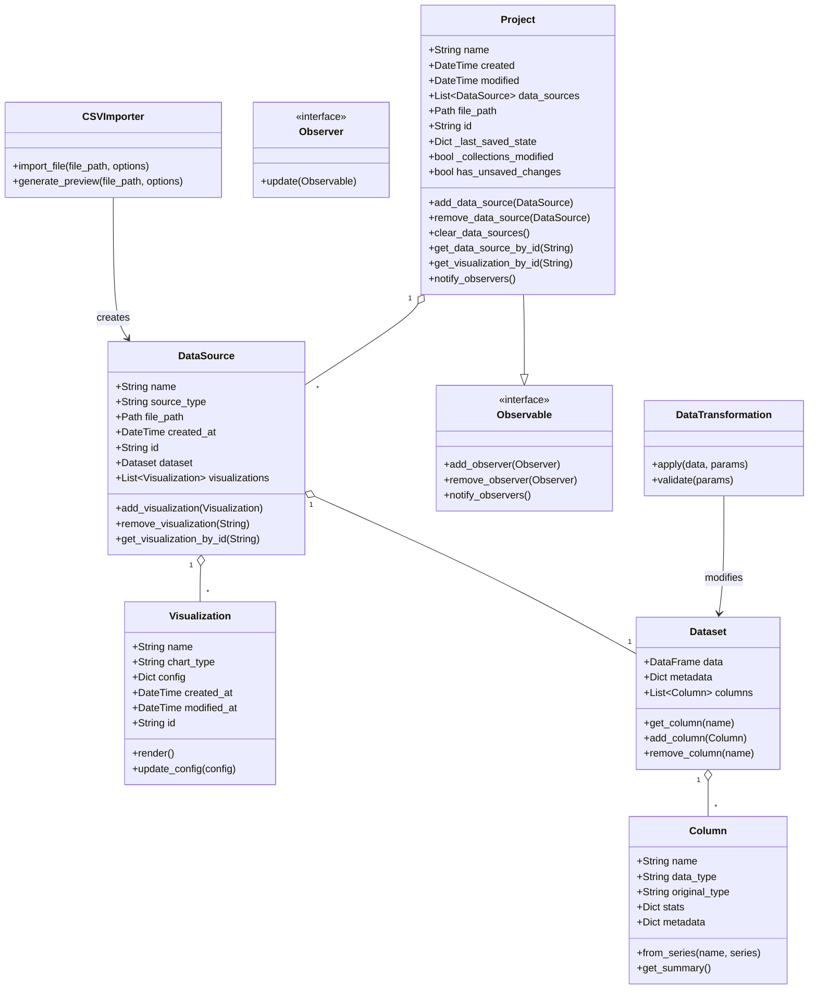
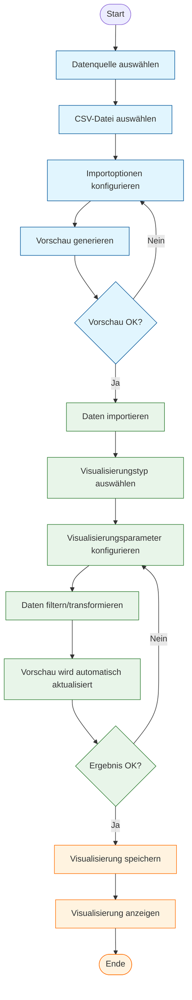
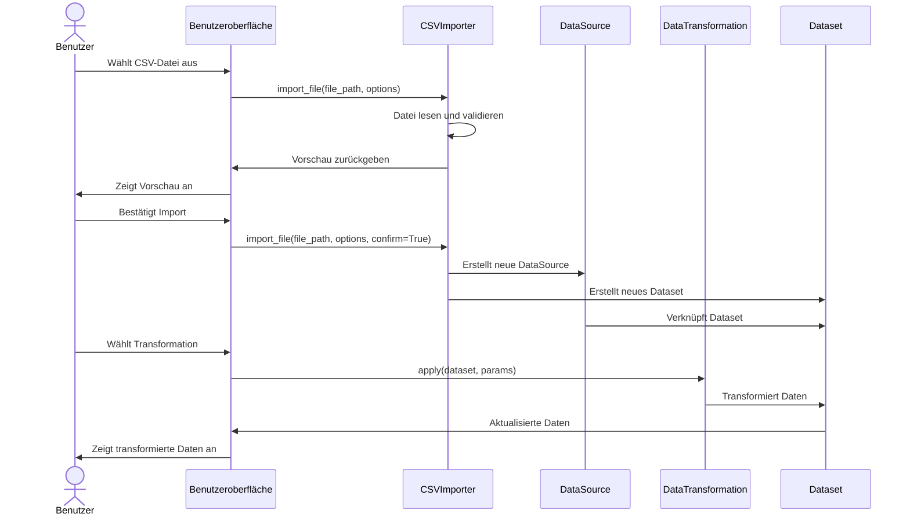
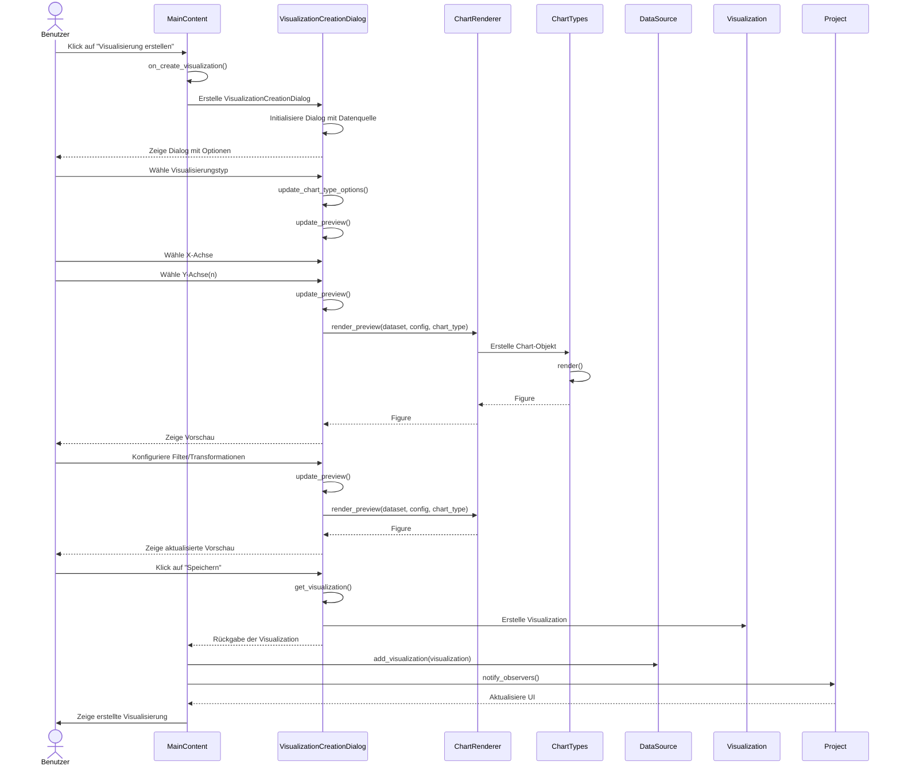
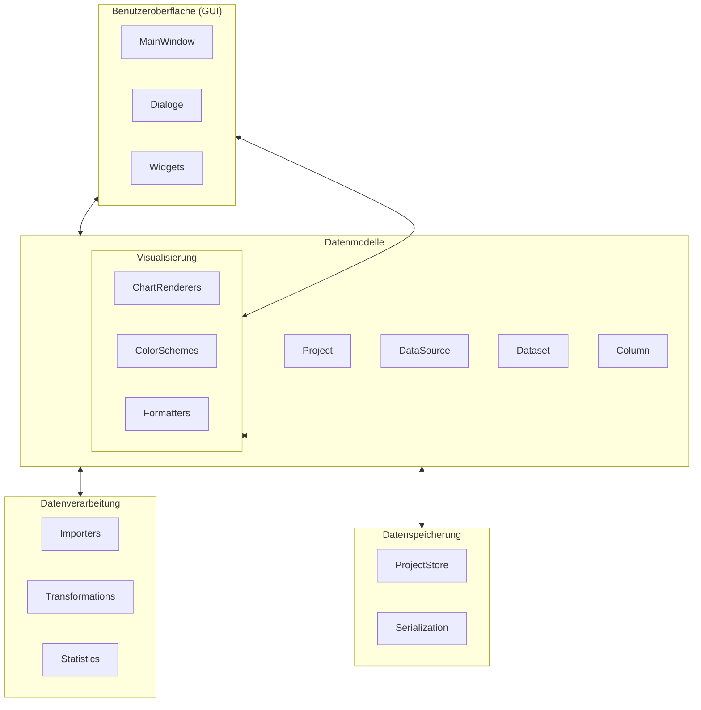

# Spezifikationsdokument „DataInspect"

## Datenmodell
Das Datenmodell von DataInspect besteht aus mehreren Kernkomponenten, die die Struktur und Beziehungen der in der Anwendung verwendeten Daten definieren.

### Geschäftsobjekte
1. **Project**
   - Repräsentiert ein Projekt in der Anwendung
   - Enthält eine Liste von DataSources, wobei jede DataSource genau ein Dataset und mehrere Visualizations enthält
   - Speichert Projektmetadaten wie Name, Erstellungsdatum, letzte Änderung und eine eindeutige ID
   - Implementiert das Observable-Pattern, um Beobachter über Änderungen zu informieren
   - Verfolgt Änderungen am Projekt, um ungespeicherte Änderungen zu erkennen
   - Bietet Methoden zum Hinzufügen, Entfernen und Verwalten von DataSources
   - Ermöglicht den Zugriff auf DataSources und Visualizations über ihre eindeutigen IDs
2. **DataSource**
   - Repräsentiert eine Datenquelle wie eine CSV-, Excel- oder JSON-Datei
   - Speichert Metainformationen wie den Quellentyp, Importzeitpunkt und eine eindeutige ID
   - Ist hierarchisch übergeordnet zu genau einem Dataset und mehreren Visualizations
   - Verwaltet die Rohdaten und bietet Methoden zum Laden und Aktualisieren
   - Bietet Methoden zum Hinzufügen, Entfernen und Abrufen von Visualizations
3. **Dataset**
   - Stellt einen verarbeiteten Datensatz dar, der aus einer DataSource abgeleitet wurde
   - Enthält die tatsächlichen Daten in einem strukturierten Format (Pandas DataFrame)
   - Besteht aus einer Sammlung von Column-Objekten, die die einzelnen Spalten repräsentieren
   - Unterstützt Operationen wie Filtern, Sortieren und Gruppieren
   - Berechnet statistische Kennzahlen für die enthaltenen Spalten
   - Speichert Metadaten wie Erstellungs- und Änderungszeitpunkt
4. **Column**
   - Repräsentiert eine einzelne Spalte/Variable in einem Dataset
   - Speichert Metadaten wie Name, Datentyp und statistische Informationen
   - Erkennt automatisch den Datentyp (numerisch, Text, Datum, kategorisch)
   - Berechnet statistische Kennzahlen wie Min, Max, Mittelwert, Median, Standardabweichung
   - Bietet Methoden zur Datentypkonvertierung und zum Umgang mit fehlenden Werten
5. **Visualization**
   - Repräsentiert ein einzelnes Diagramm oder eine Visualisierung
   - Ist mit einer DataSource verknüpft und definiert, welche Spalten visualisiert werden
   - Besitzt eine eindeutige ID zur programmatischen Ansteuerung
   - Speichert Konfigurationen wie Diagrammtyp, Farben, Beschriftungen und Achseneinstellungen
   - Verfolgt Erstellungs- und Änderungszeitpunkte

---

## UML-Klassendiagramm

**Abbildung 1:** UML-Klassendiagramm der Hauptkomponenten von DataInspect. Das Diagramm zeigt die zentralen Klassen und ihre Beziehungen. Die Klasse `Project` ist das Hauptobjekt, das mehrere `DataSource`-Objekte enthält. Jede `DataSource` hat genau ein `Dataset` und kann mehrere `Visualization`-Objekte haben. Das `Dataset` besteht aus mehreren `Column`-Objekten. Die Klassen `CSVImporter` und `DataTransformation` sind Hilfsklassen für den Import und die Transformation von Daten. Das Observer-Pattern wird durch die Interfaces `Observable` und `Observer` implementiert.

*Erstellt mit: Mermaid.js Diagramming Tool (Version 9.4.3)*

---

## Geschäftsprozesse
DataInspect unterstützt verschiedene Geschäftsprozesse, die zusammen den Workflow von der Datenquelle bis zur fertigen Visualisierung abbilden.

### Hauptprozesse
1. **Datenimport-Prozess**
   - Der Nutzer wählt eine CSV-Datenquelle aus
   - Das System überprüft die Datenquelle auf Gültigkeit und Format
   - Das System liest die Daten ein und zeigt eine Vorschau an
   - Der Nutzer kann Importoptionen anpassen (z.B. Trennzeichen, Encoding)
   - Der Nutzer kann Transformationen auf die Daten anwenden
   - Das System erstellt ein Dataset aus der Datenquelle
   - Der Nutzer kann den importierten Datensatz in der Anwendung verwenden

   *(Geplante Funktionalitäten)*
   - Import von Excel- und JSON-Dateien
   - Datenbankverbindungen für direkten Datenimport
2. **Datenvorverarbeitungs-Prozess**
   - Der Nutzer wählt einen Datensatz aus
   - Das System zeigt die verfügbaren Daten in tabellarischer Form an
   - Der Nutzer kann Transformationen auf die Daten anwenden
   - Das System führt die Transformationen aus und zeigt das Ergebnis an

   *(Geplante Funktionalitäten)*
   - Der Nutzer kann Operationen wie Filtern, Sortieren oder Gruppieren auswählen
   - Das System führt diese Operationen aus und zeigt das Ergebnis an
   - Der Nutzer kann mehrere Operationen nacheinander ausführen
   - Der Nutzer kann den verarbeiteten Datensatz für Visualisierungen verwenden
3. **Visualisierungserstellungs-Prozess**
   - Der Nutzer wählt eine Datenquelle aus
   - Der Nutzer wählt einen Diagrammtyp aus einer Liste verfügbarer Visualisierungen
   - Das System zeigt eine Vorschau der Standardvisualisierung
   - Der Nutzer wählt Spalten für die relevanten Achsen/Dimensionen aus
   - Der Nutzer passt Visualisierungsoptionen an (Farben, Titel, Beschriftungen)
   - Das System rendert die angepasste Visualisierung
   - Die Visualisierung wird der ausgewählten Datenquelle zugeordnet

   *(Geplante Funktionalitäten)*
   - Der Nutzer kann mit der Visualisierung interagieren (zoomen, filtern, usw.)
4. **Export-Prozess** *(geplante Funktionalität)*
   - Der Nutzer wählt eine fertige Visualisierung aus
   - Der Nutzer wählt das gewünschte Exportformat (PNG, JPEG, PDF)
   - Der Nutzer passt ggf. Exportoptionen an (Auflösung, Qualität)
   - Das System generiert die Exportdatei
   - Der Nutzer wählt den Speicherort aus
   - Das System speichert die Datei am gewünschten Ort
5. **Projektverwaltungs-Prozess**
   - Der Nutzer kann ein neues Projekt erstellen
   - Der Nutzer kann das aktuelle Projekt speichern
   - Der Nutzer kann ein bestehendes Projekt laden
   - Das System lädt alle Datenquellen, Datensätze und Visualisierungen aus dem Projekt

---

## UML-Aktivitätsdiagramm: Datenimport und Visualisierung

**Abbildung 2:** UML-Aktivitätsdiagramm für den Prozess des Datenimports und der Visualisierungserstellung in DataInspect. Der Prozess ist in drei Phasen unterteilt: Vorbereitung (blau), Anpassung (grün) und Abschluss (orange). Der Prozess beginnt mit der Auswahl einer CSV-Datenquelle, gefolgt von der Konfiguration der Importoptionen und der Generierung einer Vorschau. Nach dem Import wird ein Visualisierungstyp ausgewählt und die Visualisierungsparameter konfiguriert. Anschließend können die Daten gefiltert und transformiert werden, wobei die Vorschau automatisch aktualisiert wird. Nach der Überprüfung des Ergebnisses kann die Visualisierung gespeichert und angezeigt werden.

*Erstellt mit: Mermaid.js Diagramming Tool (Version 9.4.3)*

---

## Sequenzdiagramm: Datenimport und Transformation

**Abbildung 3:** Sequenzdiagramm für den Datenimport- und Transformationsprozess in DataInspect. Das Diagramm zeigt die Interaktion zwischen dem Benutzer, der Benutzeroberfläche und den verschiedenen Komponenten des Systems während des Imports einer CSV-Datei und der anschließenden Transformation der Daten.

## Sequenzdiagramm: Visualisierungserstellung

**Abbildung 4:** Sequenzdiagramm für den Visualisierungserstellungsprozess in DataInspect. Das Diagramm zeigt die Interaktion zwischen dem Benutzer, der MainContent-Komponente, dem VisualizationCreationDialog und anderen Komponenten während der Erstellung einer Visualisierung. Der Benutzer wählt einen Visualisierungstyp, konfiguriert die X- und Y-Achsen sowie Filter und Transformationen, wobei die Vorschau automatisch aktualisiert wird. Nach dem Speichern wird die Visualisierung zur DataSource hinzugefügt und in der Benutzeroberfläche angezeigt.

*Erstellt mit: Mermaid.js Diagramming Tool (Version 9.4.3)*

---

## Geschäftsregeln
Für DataInspect gelten folgende Geschäftsregeln, die für die korrekte Funktion und Nutzung der Anwendung essentiell sind:

### Datenquellen und Datensätze
- Eine Datenquelle muss mindestens eine Spalte und eine Zeile enthalten
- Jede Datenquelle muss eine eindeutige ID haben
- Jede Datenquelle ist mit genau einem Dataset verknüpft (1:1-Beziehung)
- Jede Spalte muss einen eindeutigen Namen haben
- Datentypen müssen konsistent innerhalb einer Spalte sein oder konvertierbar sein
- Fehlende Werte müssen gekennzeichnet sein (z.B. durch NULL, NA, leere Zelle)
- Die maximale Größe einer importierbaren Datei ist auf 100 MB begrenzt
- Nach dem Import wird ausschließlich mit den transformierten Daten gearbeitet, ohne Aktualisierungsmöglichkeit zur Originaldatenquelle

### Visualisierungen
- Jede Visualisierung muss mit genau einer DataSource verknüpft sein
- Jede Visualisierung muss eine eindeutige ID haben
- Visualisierungen sind hierarchisch der DataSource untergeordnet (1:n-Beziehung)
- Balken- und Liniendiagramme benötigen mindestens eine X-Achsen- und eine Y-Achsen-Spalte
- Kreisdiagramme benötigen eine Kategorie-Spalte und eine Werte-Spalte
- Streudiagramme benötigen zwei numerische Spalten (X und Y)
- Numerische Achsen müssen einen gültigen Minimalwert und Maximalwert haben
- Der Abstand von Werten auf den Achsen muss proportional zu den tatsächlichen Werten sein

### Datenbearbeitung
- Transformationen müssen den Datentyp einer Spalte respektieren oder eine explizite Typkonvertierung durchführen
- Statistische Berechnungen sind nur für numerische Spalten zulässig

*(Geplante Funktionalitäten)*
- Bei der Datenfilterung müssen alle anzuwendenden Filterbedingungen gültig sein
- Bei der Datensortierung muss mindestens eine Spalte als Sortierkriterium angegeben werden
- Bei der Datengruppierung müssen Aggregationsfunktionen für numerische Spalten angegeben werden

### Projekte
- Jedes Projekt muss einen eindeutigen Namen und eine eindeutige ID haben
- Ein Projekt enthält eine Liste von DataSources, wobei jede DataSource genau ein Dataset und mehrere Visualizations enthält
- Die hierarchische Struktur (Project → DataSources → Dataset/Visualizations) muss eingehalten werden
- Das Projekt verfolgt Änderungen, um ungespeicherte Änderungen zu erkennen
- Änderungen am Projekt müssen explizit gespeichert werden, um persistiert zu werden
- Projektdateien müssen ein definiertes Format haben (.dinsp-Dateierweiterung) und werden im JSON-Format gespeichert
- Beim Laden eines Projekts müssen alle referenzierten Datenquellen verfügbar sein

### Export *(geplante Funktionalität)*
- Exportierte Bilddateien müssen mindestens eine Auflösung von 300 dpi haben
- Bei PDF-Export müssen alle Schriftarten eingebettet werden
- Die maximale Größe für exportierte Dateien beträgt 50 MB

---

## Systemschnittstellen
DataInspect kommuniziert mit verschiedenen externen Systemen und Datenquellen über definierte Schnittstellen:

1. **Dateisystem**
   - Zweck: Import von CSV-Datendateien, Speichern/Laden von Projekten
   - Protokoll: Direkte Dateioperationen über das Betriebssystem
   - Datenformat: CSV für Import; projektspezifisches Format (.dinsp) für Projekte

   *(Geplante Funktionalitäten)*
   - Import von Excel (XLSX/XLS) und JSON-Dateien
   - Export von Visualisierungen als PNG, JPEG, PDF

2. **SQLite-Datenbanken** *(geplante Funktionalität)*
   - Zweck: Zugriff auf strukturierte Daten in lokalen SQLite-Datenbanken
   - Protokoll: SQLite3 API über entsprechende Python-Bibliothek
   - Datenformat: SQL-Abfragen und -Ergebnisse
3. **Zwischenablage**
   - Zweck: Ermöglicht Kopieren und Einfügen von Daten zwischen der Anwendung und anderen Programmen
   - Protokoll: Betriebssystem-Zwischenablage
   - Datenformat: Tabellendaten (TSV), Bilder
4. **Python-Bibliotheken**
   - Zweck: Nutzung externer Bibliotheken für Datenverarbeitung (Pandas) und Visualisierung (Matplotlib)
   - Protokoll: Python-Module und API-Aufrufe
   - Datenformat: Python-Objekte (Pandas DataFrames, Matplotlib-Figuren)

---

## Komponentendiagramm: Systemarchitektur

**Abbildung 5:** Komponentendiagramm der Systemarchitektur von DataInspect. Das Diagramm zeigt die Hauptkomponenten des Systems und ihre Beziehungen. Die Benutzeroberfläche (GUI) interagiert mit den Datenmodellen, die wiederum mit der Datenverarbeitung, Visualisierung und Datenspeicherung verbunden sind.

*Erstellt mit: Mermaid.js Diagramming Tool (Version 9.4.3)*

---

## Verwendete Software für Diagramme

Alle Diagramme in der Dokumentation wurden mit dem folgenden Tool erstellt:

1. **Mermaid.js (Version 9.4.3)**
   - Webbasiertes Diagramm-Tool für die Erstellung von UML-Diagrammen
   - Verwendet Markdown-ähnliche Syntax zur Definition von Diagrammen
   - Integriert in die Markdown-Dokumentation
   - Website: [https://mermaid.js.org/](https://mermaid.js.org/)

2. **Visual Studio Code mit Mermaid-Erweiterung**
   - Verwendung der Mermaid-Erweiterung für die Vorschau und Bearbeitung der Diagramme
   - Ermöglicht Live-Vorschau während der Bearbeitung

Die Verwendung von Mermaid.js bietet mehrere Vorteile:
- Textbasierte Definition von Diagrammen, die gut mit Versionskontrollsystemen wie Git funktioniert
- Einfache Integration in Markdown-Dokumente
- Konsistentes Erscheinungsbild aller Diagramme
- Möglichkeit zur automatischen Generierung von Diagrammen aus Code oder Daten

Hinweis: Aus Zeitgründen wurden keine separaten Mockups der Benutzeroberfläche erstellt. Die UI-Entwicklung erfolgte direkt im Code mit PyQt6.

---

## Dokumentation der Änderungen an der Spezifikation

### Übersicht der Änderungen

Im Laufe der Implementierung wurden einige Anpassungen an der ursprünglichen Spezifikation vorgenommen, um die Anwendung robuster, benutzerfreundlicher und wartbarer zu gestalten. Diese Änderungen betreffen hauptsächlich das Datenmodell und die Beziehungen zwischen den Hauptkomponenten.

### Datenmodell-Änderungen

#### 1. Beziehung zwischen DataSource und Dataset

**Ursprüngliche Spezifikation:**
- Eine DataSource konnte mit mehreren Datasets verknüpft sein (1:n-Beziehung)
- Datasets waren direkt mit Project verknüpft

**Neue Implementierung:**
- Eine DataSource ist mit genau einem Dataset verknüpft (1:1-Beziehung)
- Nach dem Import wird ausschließlich mit den transformierten Daten gearbeitet, ohne Aktualisierungsmöglichkeit zur Originaldatenquelle

**Begründung:**
- Vermeidung von Inkonsistenzen zwischen Originaldaten und transformierten Daten
- Klarere Verantwortlichkeiten und einfachere Verwaltung von Beziehungen
- Intuitiveres Modell für Endbenutzer

#### 2. Hierarchische Struktur für Visualisierungen

**Ursprüngliche Spezifikation:**
- Visualisierungen waren mit Datasets verknüpft
- Project hatte direkte Referenzen zu Visualisierungen

**Neue Implementierung:**
- Visualisierungen sind hierarchisch der DataSource untergeordnet (1:n-Beziehung)
- Project hat keine direkten Referenzen mehr zu Visualisierungen, sondern nur zu DataSources

**Begründung:**
- Einheitliche hierarchische Struktur (Project → DataSources → Dataset/Visualizations)
- Intuitivere Organisation in der UI mit Visualisierungen direkt unter der Datenquelle
- Direkter Zugriff auf alle Visualisierungen einer Datenquelle

#### 3. Eindeutige IDs für alle Modelobjekte

**Ursprüngliche Spezifikation:**
- Keine explizite Anforderung für eindeutige IDs

**Neue Implementierung:**
- Alle Hauptobjekte (Project, DataSource, Visualization) haben eindeutige UUIDs

**Begründung:**
- Einfache und eindeutige Identifikation von Objekten
- Zuverlässige Identifikation auch nach Umbenennungen
- Vorbereitung für mögliche zukünftige Funktionen wie Versionierung oder Synchronisation

#### 4. Erweiterte Column-Klasse

**Ursprüngliche Spezifikation:**
- Grundlegende Spaltenattribute waren definiert, aber keine Details zur Typbestimmung

**Neue Implementierung:**
- Automatische Erkennung und Klassifizierung von Datentypen (numerisch, Text, Datum, kategorisch)
- Berechnung statistischer Kennzahlen wie Min, Max, Mittelwert, Median, Standardabweichung
- Speicherung von Metadaten und statistischen Informationen

**Begründung:**
- Keine manuelle Typzuweisung erforderlich
- Bessere Standardeinstellungen für Visualisierungen basierend auf erkannten Typen
- Typspezifische statistische Berechnungen

### Prozess-Änderungen

#### 1. Visualisierungserstellungs-Prozess

**Ursprüngliche Spezifikation:**
- Der Nutzer wählt einen Datensatz aus
- Die Visualisierung wird mit dem Dataset verknüpft

**Neue Implementierung:**
- Der Nutzer wählt eine Datenquelle aus
- Die Visualisierung wird der ausgewählten Datenquelle zugeordnet

**Begründung:**
- Konsistenz mit der hierarchischen Struktur
- Intuitivere Benutzerführung
- Vereinfachte Navigation in der Anwendung

### Technische Herausforderungen und Lösungen

#### 1. Zirkuläre Importe

**Problem:**
- Bei der Integration der Column-Klasse traten zirkuläre Importprobleme auf

**Lösung:**
- Die Column-Klasse wurde direkt in die models.py-Datei integriert, anstatt sie als separates Modul zu implementieren

#### 2. Serialisierung von NumPy-Datentypen

**Problem:**
- NumPy-Datentypen wie int64 sind nicht direkt JSON-serialisierbar

**Lösung:**
- Implementierung einer speziellen to_json-Methode, die NumPy-Datentypen in Python-Standardtypen konvertiert

### Auswirkungen auf die Benutzeroberfläche

Die Änderungen am Datenmodell haben zu einer klareren und intuitiveren Benutzeroberfläche geführt:

1. **Vereinfachte Navigation:** Die hierarchische Struktur ermöglicht eine einfachere Navigation durch die Daten und Visualisierungen
2. **Konsistente Darstellung:** Visualisierungen werden immer im Kontext ihrer Datenquelle angezeigt
3. **Verbesserte Datenanalyse:** Die erweiterte Column-Klasse ermöglicht eine detailliertere Analyse der Daten
