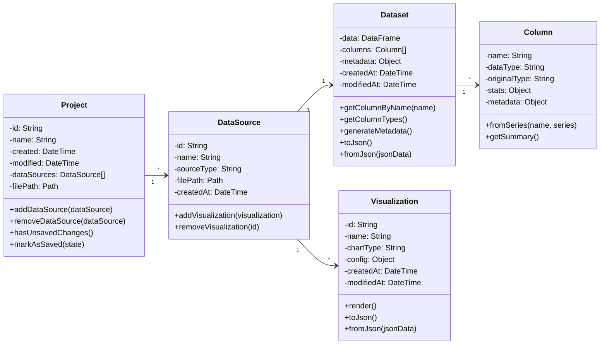
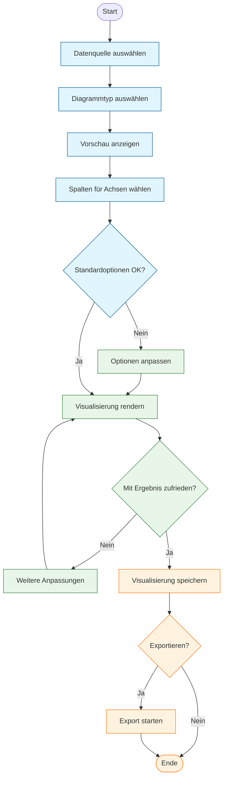

# Spezifikationsdokument „DataInspect“

## Datenmodell
Das Datenmodell von DataInspect besteht aus mehreren Kernkomponenten, die die Struktur und Beziehungen der in der Anwendung verwendeten Daten definieren.

### Geschäftsobjekte
1. **DataSource**
   - Repräsentiert eine Datenquelle wie eine CSV-, Excel- oder JSON-Datei
   - Speichert Metainformationen wie den Quellentyp, Importzeitpunkt und eine eindeutige ID
   - Ist hierarchisch übergeordnet zu genau einem Dataset und mehreren Visualizations
   - Verwaltet die Rohdaten und bietet Methoden zum Laden und Aktualisieren
2. **Dataset**
   - Stellt einen verarbeiteten Datensatz dar, der aus einer DataSource abgeleitet wurde
   - Enthält die tatsächlichen Daten in einem strukturierten Format
   - Besteht aus einer Sammlung von Column-Objekten, die die einzelnen Spalten repräsentieren
   - Unterstützt Operationen wie Filtern, Sortieren und Gruppieren
   - Berechnet statistische Kennzahlen für die enthaltenen Spalten
3. **Column**
   - Repräsentiert eine einzelne Spalte/Variable in einem Dataset
   - Speichert Metadaten wie Name, Datentyp und statistische Informationen
   - Erkennt automatisch den Datentyp (numerisch, Text, Datum, kategorisch)
   - Berechnet statistische Kennzahlen wie Min, Max, Mittelwert, Median, Standardabweichung
   - Bietet Methoden zur Datentypkonvertierung und zum Umgang mit fehlenden Werten
4. **Visualization**
   - Repräsentiert ein einzelnes Diagramm oder eine Visualisierung
   - Ist mit einer DataSource verknüpft und definiert, welche Spalten visualisiert werden
   - Besitzt eine eindeutige ID zur programmatischen Ansteuerung
   - Speichert Konfigurationen wie Diagrammtyp, Farben, Beschriftungen und Achseneinstellungen
5. **Project**
   - Repräsentiert ein Projekt in der Anwendung
   - Enthält eine Liste von DataSources, wobei jede DataSource genau ein Dataset und mehrere Visualizations enthält
   - Speichert Projektmetadaten wie Name, Erstellungsdatum, letzte Änderung und eine eindeutige ID
   - Ermöglicht das Speichern und Laden des gesamten Projektstatus
   - Verfolgt Änderungen am Projekt, um ungespeicherte Änderungen zu erkennen

---

## UML-Klassendiagramm

---

## Geschäftsprozesse
DataInspect unterstützt verschiedene Geschäftsprozesse, die zusammen den Workflow von der Datenquelle bis zur fertigen Visualisierung abbilden.

### Hauptprozesse
1. **Datenimport-Prozess**
   - Der Nutzer wählt eine CSV-Datenquelle aus
   - Das System überprüft die Datenquelle auf Gültigkeit und Format
   - Das System liest die Daten ein und zeigt eine Vorschau an
   - Der Nutzer kann Importoptionen anpassen (z.B. Trennzeichen, Encoding)
   - Der Nutzer kann Transformationen auf die Daten anwenden
   - Das System erstellt ein Dataset aus der Datenquelle
   - Der Nutzer kann den importierten Datensatz in der Anwendung verwenden

   *(Geplante Funktionalitäten)*
   - Import von Excel- und JSON-Dateien
   - Datenbankverbindungen für direkten Datenimport
2. **Datenvorverarbeitungs-Prozess**
   - Der Nutzer wählt einen Datensatz aus
   - Das System zeigt die verfügbaren Daten in tabellarischer Form an
   - Der Nutzer kann Transformationen auf die Daten anwenden
   - Das System führt die Transformationen aus und zeigt das Ergebnis an

   *(Geplante Funktionalitäten)*
   - Der Nutzer kann Operationen wie Filtern, Sortieren oder Gruppieren auswählen
   - Das System führt diese Operationen aus und zeigt das Ergebnis an
   - Der Nutzer kann mehrere Operationen nacheinander ausführen
   - Der Nutzer kann den verarbeiteten Datensatz für Visualisierungen verwenden
3. **Visualisierungserstellungs-Prozess**
   - Der Nutzer wählt eine Datenquelle aus
   - Der Nutzer wählt einen Diagrammtyp aus einer Liste verfügbarer Visualisierungen
   - Das System zeigt eine Vorschau der Standardvisualisierung
   - Der Nutzer wählt Spalten für die relevanten Achsen/Dimensionen aus
   - Der Nutzer passt Visualisierungsoptionen an (Farben, Titel, Beschriftungen)
   - Das System rendert die angepasste Visualisierung
   - Die Visualisierung wird der ausgewählten Datenquelle zugeordnet

   *(Geplante Funktionalitäten)*
   - Der Nutzer kann mit der Visualisierung interagieren (zoomen, filtern, usw.)
4. **Export-Prozess** *(geplante Funktionalität)*
   - Der Nutzer wählt eine fertige Visualisierung aus
   - Der Nutzer wählt das gewünschte Exportformat (PNG, JPEG, PDF)
   - Der Nutzer passt ggf. Exportoptionen an (Auflösung, Qualität)
   - Das System generiert die Exportdatei
   - Der Nutzer wählt den Speicherort aus
   - Das System speichert die Datei am gewünschten Ort
5. **Projektverwaltungs-Prozess**
   - Der Nutzer kann ein neues Projekt erstellen
   - Der Nutzer kann das aktuelle Projekt speichern
   - Der Nutzer kann ein bestehendes Projekt laden
   - Das System lädt alle Datenquellen, Datensätze und Visualisierungen aus dem Projekt

---

## UML-Aktivitätsdiagramm für den Visualisierungserstellungs-Prozess

---

## Geschäftsregeln
Für DataInspect gelten folgende Geschäftsregeln, die für die korrekte Funktion und Nutzung der Anwendung essentiell sind:

### Datenquellen und Datensätze
- Eine Datenquelle muss mindestens eine Spalte und eine Zeile enthalten
- Jede Datenquelle muss eine eindeutige ID haben
- Jede Datenquelle ist mit genau einem Dataset verknüpft (1:1-Beziehung)
- Jede Spalte muss einen eindeutigen Namen haben
- Datentypen müssen konsistent innerhalb einer Spalte sein oder konvertierbar sein
- Fehlende Werte müssen gekennzeichnet sein (z.B. durch NULL, NA, leere Zelle)
- Die maximale Größe einer importierbaren Datei ist auf 100 MB begrenzt
- Nach dem Import wird ausschließlich mit den transformierten Daten gearbeitet, ohne Aktualisierungsmöglichkeit zur Originaldatenquelle

### Visualisierungen
- Jede Visualisierung muss mit genau einer DataSource verknüpft sein
- Jede Visualisierung muss eine eindeutige ID haben
- Visualisierungen sind hierarchisch der DataSource untergeordnet (1:n-Beziehung)
- Balken- und Liniendiagramme benötigen mindestens eine X-Achsen- und eine Y-Achsen-Spalte
- Kreisdiagramme benötigen eine Kategorie-Spalte und eine Werte-Spalte
- Streudiagramme benötigen zwei numerische Spalten (X und Y)
- Numerische Achsen müssen einen gültigen Minimalwert und Maximalwert haben
- Der Abstand von Werten auf den Achsen muss proportional zu den tatsächlichen Werten sein

### Datenbearbeitung
- Transformationen müssen den Datentyp einer Spalte respektieren oder eine explizite Typkonvertierung durchführen
- Statistische Berechnungen sind nur für numerische Spalten zulässig

*(Geplante Funktionalitäten)*
- Bei der Datenfilterung müssen alle anzuwendenden Filterbedingungen gültig sein
- Bei der Datensortierung muss mindestens eine Spalte als Sortierkriterium angegeben werden
- Bei der Datengruppierung müssen Aggregationsfunktionen für numerische Spalten angegeben werden

### Projekte
- Jedes Projekt muss einen eindeutigen Namen und eine eindeutige ID haben
- Ein Projekt enthält eine Liste von DataSources, wobei jede DataSource genau ein Dataset und mehrere Visualizations enthält
- Die hierarchische Struktur (Project → DataSources → Dataset/Visualizations) muss eingehalten werden
- Das Projekt verfolgt Änderungen, um ungespeicherte Änderungen zu erkennen
- Änderungen am Projekt müssen explizit gespeichert werden, um persistiert zu werden
- Projektdateien müssen ein definiertes Format haben (.dinsp-Dateierweiterung) und werden im JSON-Format gespeichert
- Beim Laden eines Projekts müssen alle referenzierten Datenquellen verfügbar sein

### Export *(geplante Funktionalität)*
- Exportierte Bilddateien müssen mindestens eine Auflösung von 300 dpi haben
- Bei PDF-Export müssen alle Schriftarten eingebettet werden
- Die maximale Größe für exportierte Dateien beträgt 50 MB

---

## Systemschnittstellen
DataInspect kommuniziert mit verschiedenen externen Systemen und Datenquellen über definierte Schnittstellen:

1. **Dateisystem**
   - Zweck: Import von CSV-Datendateien, Speichern/Laden von Projekten
   - Protokoll: Direkte Dateioperationen über das Betriebssystem
   - Datenformat: CSV für Import; projektspezifisches Format (.dinsp) für Projekte

   *(Geplante Funktionalitäten)*
   - Import von Excel (XLSX/XLS) und JSON-Dateien
   - Export von Visualisierungen als PNG, JPEG, PDF

2. **SQLite-Datenbanken** *(geplante Funktionalität)*
   - Zweck: Zugriff auf strukturierte Daten in lokalen SQLite-Datenbanken
   - Protokoll: SQLite3 API über entsprechende Python-Bibliothek
   - Datenformat: SQL-Abfragen und -Ergebnisse
3. **Zwischenablage**
   - Zweck: Ermöglicht Kopieren und Einfügen von Daten zwischen der Anwendung und anderen Programmen
   - Protokoll: Betriebssystem-Zwischenablage
   - Datenformat: Tabellendaten (TSV), Bilder
4. **Python-Bibliotheken**
   - Zweck: Nutzung externer Bibliotheken für Datenverarbeitung (Pandas) und Visualisierung (Matplotlib)
   - Protokoll: Python-Module und API-Aufrufe
   - Datenformat: Python-Objekte (Pandas DataFrames, Matplotlib-Figuren)

---

## Benutzerschnittstellen
DataInspect verfügt über eine grafische Benutzeroberfläche, die auf Benutzerfreundlichkeit und Intuitivität ausgelegt ist. Im Folgenden werden die wichtigsten Dialogelemente beschrieben:

### Hauptfenster
Das Hauptfenster ist das zentrale Element der Anwendung und besteht aus mehreren Bereichen:
- **Menüleiste:** Enthält Hauptmenüs für Datei, Bearbeiten, Ansicht, Daten, Visualisierung und Hilfe
- **Werkzeugleiste:** Bietet schnellen Zugriff auf häufig verwendete Funktionen
- **Datenverwaltungsbereich (linke Seitenleiste):** Zeigt verfügbare Datenquellen, Datensätze und Visualisierungen hierarchisch an
- **Hauptarbeitsbereich (zentral):** Zeigt je nach Kontext die aktuelle Datenvorschau oder Visualisierung
- **Eigenschaftenbereich (rechte Seitenleiste):** Zeigt Eigenschaften des aktuell ausgewählten Elements und ermöglicht Anpassungen
- **Statusleiste:** Zeigt Informationen zum aktuellen Status der Anwendung und laufenden Operationen

### Dialog: Datenimport
Der Datenimport-Dialog wird geöffnet, wenn der Nutzer neue Daten importieren möchte:
- **Dateityp-Auswahl:** Dropdown-Menü zur Auswahl des zu importierenden Dateityps (CSV, Excel, JSON)
- **Dateiauswahl:** Datei-Browser zur Auswahl der zu importierenden Datei
- **Vorschaubereich:** Zeigt eine Vorschau der zu importierenden Daten
- **Importoptionen:** Spezifische Optionen je nach Dateityp (z.B. Trennzeichen für CSV)
- **Schaltflächen:** "Importieren", "Abbrechen"

### Dialog: Diagrammerstellung
Der Diagrammerstellungs-Dialog wird verwendet, um neue Visualisierungen zu erstellen:
- **Diagrammtyp-Auswahl:** Visuelle Auswahl der verfügbaren Diagrammtypen mit Miniaturansichten
- **Spaltenzuordnung:** Drag-and-Drop-Bereich zur Zuordnung von Datenspalten zu Diagrammelementen (X-Achse, Y-Achse, Farbe, Größe, etc.)
- **Diagrammvorschau:** Live-Vorschau des aktuell konfigurierten Diagramms
- **Anpassungsoptionen:** Einstellungen für Farben, Beschriftungen, Skalen, etc.
- **Schaltflächen:** "Erstellen", "Abbrechen"

### Dialog: Exportoptionen *(geplante Funktionalität)*
Der Export-Dialog ermöglicht die Konfiguration des Exports:
- **Format-Auswahl:** Auswahl des Exportformats (PNG, JPEG, PDF)
- **Größeneinstellungen:** Eingabefelder für Breite und Höhe der Ausgabe
- **Qualitätseinstellungen:** Schieberegler für Qualität/Kompression (bei JPEG)
- **Optionen:** Zusätzliche formatspezifische Optionen
- **Vorschau:** Vorschau des zu exportierenden Elements
- **Schaltflächen:** "Exportieren", "Abbrechen"

---

## Dialogflüsse
Die Hauptdialogflüsse in der Anwendung sind:
1. **Datenimport-Fluss:** Hauptfenster → Menü "Datei" → "Daten importieren" → Datenimport-Dialog → Dateiauswahl → Importoptionen anpassen → Vorschau prüfen → "Importieren" → Hauptfenster (mit importierten Daten)
2. **Visualisierungserstellungs-Fluss:** Hauptfenster → Menü "Visualisierung" → "Neue Visualisierung" → Diagrammerstellungs-Dialog → Diagrammtyp auswählen → Spalten zuordnen → Anpassungen vornehmen → "Erstellen" → Hauptfenster (mit neuer Visualisierung)
3. **Export-Fluss:** *(geplante Funktionalität)* Hauptfenster (mit ausgewählter Visualisierung) → Menü "Datei" → "Exportieren" → Exportoptionen-Dialog → Format und Optionen wählen → "Exportieren" → Datei-Browser (zur Speicherortwahl) → Hauptfenster

---

## Eingabevalidierung
Die Anwendung validiert Benutzereingaben nach folgenden Regeln:
- **Dateinamen:** Müssen gültige Dateipfade ohne unerlaubte Zeichen sein
- **Numerische Eingaben:** Müssen gültige Zahlen im erlaubten Bereich sein
- **Textfelder:** Dürfen keine leeren Werte haben, wenn sie erforderlich sind
- **Formatierungsangaben:** Müssen syntaktisch korrekt sein (z.B. Datumsformate)

Bei ungültigen Eingaben werden dem Benutzer klare Fehlermeldungen angezeigt, die das Problem und mögliche Lösungen beschreiben.
