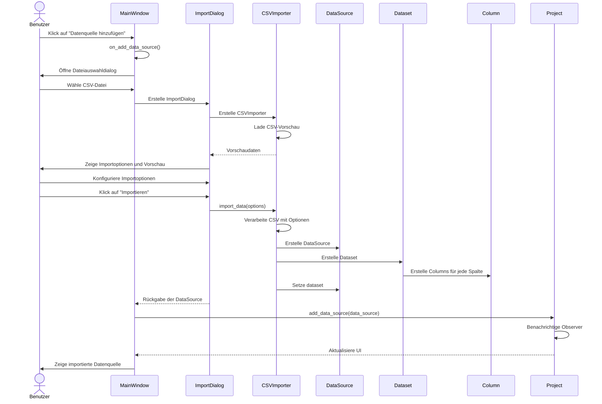

# Architekturdokument „DataInspect"

## Technologieübersicht

### Programmiersprache
- **Python 3.12.8**
  - Gewählt aufgrund der umfangreichen Bibliotheken für Datenverarbeitung und Visualisierung
  - Einfache Syntax und schnelle Entwicklung ermöglichen eine effiziente Implementierung
  - Starke Unterstützung für wissenschaftliche Berechnungen und Datenanalyse
  - Plattformunabhängigkeit für Einsatz auf verschiedenen Betriebssystemen

### GUI-Framework
- **PyQt6**
  - Umfassendes und ausgereiftes GUI-Framework mit moderner Optik
  - Unterstützung für komplexe Benutzeroberflächen mit Docking-Widgets, Tabellen und Diagrammen
  - Gute Integration mit Python und anderen Bibliotheken
  - Umfangreiche Dokumentation und aktive Community

### Datenverarbeitung
- **Pandas 2.1.4**
  - Leistungsstarke Bibliothek für Datenmanipulation und -analyse
  - Effiziente Datenstrukturen (DataFrame, Series) für tabellarische Daten
  - Umfangreiche Funktionen für Datenbereinigung, -transformation und -analyse
  - Gute Unterstützung für verschiedene Dateiformate (CSV, Excel, JSON)

### Visualisierung
- **Matplotlib 3.8.2**
  - Flexible Bibliothek für statische, animierte und interaktive Visualisierungen
  - Umfangreiche Anpassungsmöglichkeiten für professionelle Diagramme
  - Gute Integration mit PyQt für eingebettete Diagramme
  - Unterstützung für verschiedene Diagrammtypen (Balken, Linien, Kreis, Streu, Heatmap)

### Persistenz
- **JSON**
  - Leichtgewichtiges, menschenlesbares Datenaustauschformat
  - Einfache Serialisierung und Deserialisierung von Python-Objekten
  - Gute Unterstützung in Python durch die integrierte json-Bibliothek
  - Flexibles Schema für einfache Erweiterbarkeit

## Architekturübersicht

### Architekturstil
DataInspect verwendet eine Kombination aus Model-View-Controller (MVC) und Model-View-ViewModel (MVVM) Architekturstilen:

- **Model:** Repräsentiert die Daten und die Geschäftslogik (DataSource, Dataset, Column, Visualization, Project)
- **View:** Stellt die Benutzeroberfläche dar (MainWindow, Dialoge, Widgets)
- **Controller/ViewModel:** Verbindet Model und View, verarbeitet Benutzerinteraktionen und aktualisiert das Model und die View entsprechend

Diese Architektur ermöglicht eine klare Trennung von Daten, Logik und Präsentation, was die Wartbarkeit und Testbarkeit der Anwendung verbessert.

### Hauptkomponenten

#### Präsentationsschicht
- **MainWindow:** Hauptfenster der Anwendung mit Menüs, Werkzeugleisten und Hauptbereichen
- **Dialoge:** Spezialisierte Dialoge für Datenimport, Visualisierungserstellung und Export
- **Widgets:** Wiederverwendbare UI-Komponenten wie Tabellen, Diagramme und Listen
- **Renderer:** Komponenten zur Darstellung von Visualisierungen

#### Anwendungsschicht
- **Controller:** Koordinieren Aktionen zwischen Benutzeroberfläche und Datenmodell
- **Services:** Bieten spezialisierte Funktionalitäten wie Datenimport, -export und -transformation
- **Utilities:** Hilfsfunktionen für verschiedene Aufgaben wie Dateiverwaltung und Formatierung

#### Datenschicht
- **Models:** Datenmodelle für die Kernentitäten der Anwendung
- **ProjectStore:** Verantwortlich für das Laden und Speichern von Projekten
- **DataImporter:** Spezialisierte Klassen für den Import verschiedener Datenformate

### Design-Entscheidungen

#### Observer-Pattern
- **Implementierung:** Verwendung des Observer-Patterns für die Kommunikation zwischen Modellen und Views
- **Vorteile:** Lose Kopplung zwischen Komponenten, automatische UI-Aktualisierung bei Datenänderungen
- **Alternative:** Direkter Aufruf von Update-Methoden, was jedoch zu einer engeren Kopplung führen würde

#### Hierarchische Datenstruktur
- **Implementierung:** Hierarchische Struktur mit Project → DataSources → Dataset/Visualizations
- **Vorteile:** Klare Organisation, einfachere Navigation und Verwaltung von Beziehungen
- **Alternative:** Flache Struktur mit direkten Referenzen, was jedoch die Verwaltung von Beziehungen erschweren würde

#### Serialisierung mit JSON
- **Implementierung:** Verwendung von JSON für die Persistenz von Projekten und Daten
- **Vorteile:** Menschenlesbar, einfach zu debuggen, flexibel erweiterbar
- **Alternative:** Binäre Formate wie Pickle, die jedoch weniger portabel und schwerer zu debuggen sind

## Struktur

### Hauptklassen

#### Project
- **Zweck:** Repräsentiert ein Projekt in der Anwendung
- **Attribute:**
  - `name: str` - Name des Projekts
  - `created: datetime` - Erstellungszeitpunkt
  - `modified: datetime` - Zeitpunkt der letzten Änderung
  - `data_sources: List[DataSource]` - Liste der Datenquellen
  - `file_path: Optional[Path]` - Pfad zur Projektdatei
  - `id: str` - Eindeutige ID des Projekts
- **Methoden:**
  - `add_data_source(data_source: DataSource) -> None` - Fügt eine Datenquelle hinzu
  - `remove_data_source(data_source: DataSource) -> None` - Entfernt eine Datenquelle
  - `has_unsaved_changes() -> bool` - Prüft auf ungespeicherte Änderungen
  - `mark_as_saved(state: Dict[str, Any]) -> None` - Markiert den aktuellen Zustand als gespeichert

#### DataSource
- **Zweck:** Repräsentiert eine Datenquelle
- **Attribute:**
  - `name: str` - Name der Datenquelle
  - `source_type: str` - Typ der Datenquelle (CSV, Excel, JSON)
  - `file_path: Path` - Pfad zur Quelldatei
  - `created_at: datetime` - Erstellungszeitpunkt
  - `id: str` - Eindeutige ID der Datenquelle
  - `dataset: Optional[Dataset]` - Zugehöriger Datensatz
  - `visualizations: List[Visualization]` - Liste der Visualisierungen
- **Methoden:**
  - `add_visualization(visualization: Visualization) -> None` - Fügt eine Visualisierung hinzu
  - `remove_visualization(visualization_id: str) -> None` - Entfernt eine Visualisierung

#### Dataset
- **Zweck:** Repräsentiert einen verarbeiteten Datensatz
- **Attribute:**
  - `data: pd.DataFrame` - Die eigentlichen Daten als Pandas DataFrame
  - `metadata: Dict[str, Any]` - Metadaten zum Datensatz
  - `created_at: datetime` - Erstellungszeitpunkt
  - `modified_at: datetime` - Zeitpunkt der letzten Änderung
  - `columns: List[Column]` - Liste der Spalten
- **Methoden:**
  - `get_column_by_name(name: str) -> Optional[Column]` - Gibt eine Spalte anhand des Namens zurück
  - `get_column_types() -> Dict[str, str]` - Gibt die Datentypen aller Spalten zurück
  - `generate_metadata(source_info: Dict[str, Any] | None = None) -> None` - Generiert Metadaten
  - `to_json() -> Dict[str, Any]` - Konvertiert den Datensatz in ein JSON-serialisierbares Dictionary
  - `from_json(json_data: Dict[str, Any]) -> 'Dataset'` - Erstellt einen Datensatz aus JSON-Daten

#### Column
- **Zweck:** Repräsentiert eine einzelne Spalte in einem Datensatz
- **Attribute:**
  - `name: str` - Name der Spalte
  - `data_type: str` - Datentyp (numeric, text, date, categorical)
  - `original_type: str` - Ursprünglicher Pandas-Datentyp
  - `stats: Dict[str, Any]` - Statistische Kennzahlen
  - `metadata: Dict[str, Any]` - Zusätzliche Metadaten
- **Methoden:**
  - `from_series(name: str, series: pd.Series) -> 'Column'` - Erstellt eine Column-Instanz aus einer Pandas Series
  - `get_summary() -> Dict[str, Any]` - Liefert eine Zusammenfassung der Spalte

#### Visualization
- **Zweck:** Repräsentiert eine Visualisierung
- **Attribute:**
  - `name: str` - Name der Visualisierung
  - `chart_type: str` - Diagrammtyp (bar, line, pie, scatter, heatmap)
  - `config: Dict[str, Any]` - Konfiguration der Visualisierung
  - `created_at: datetime` - Erstellungszeitpunkt
  - `modified_at: datetime` - Zeitpunkt der letzten Änderung
  - `id: str` - Eindeutige ID der Visualisierung
- **Methoden:**
  - `render(figure: Figure, axes: Axes) -> None` - Rendert die Visualisierung
  - `to_json() -> Dict[str, Any]` - Konvertiert die Visualisierung in ein JSON-serialisierbares Dictionary
  - `from_json(json_data: Dict[str, Any]) -> 'Visualization'` - Erstellt eine Visualisierung aus JSON-Daten

### Paketstruktur
Die Anwendung ist in folgende Pakete organisiert:

- **src/**
  - **data/** - Datenmodelle und -verarbeitung
    - **models.py** - Kernklassen für Datenmodelle
    - **importers/** - Spezialisierte Importklassen für verschiedene Datenformate
    - **transformers/** - Klassen für Datentransformationen
  - **ui/** - Benutzeroberfläche
    - **main_window.py** - Hauptfenster der Anwendung
    - **dialogs/** - Spezialisierte Dialoge
    - **widgets/** - Wiederverwendbare UI-Komponenten
  - **services/** - Dienste und Hilfsfunktionen
    - **project_store.py** - Laden und Speichern von Projekten
    - **visualization/** - Visualisierungsdienste
  - **utils/** - Allgemeine Hilfsfunktionen
- **tests/** - Testfälle für die Anwendung
- **resources/** - Statische Ressourcen wie Icons und Stylesheets

### Entwurfsmuster

#### Observer-Pattern
- **Implementierung:** Die Observable-Klasse und ihre Unterklassen (Project, DataSource) benachrichtigen registrierte Observer über Änderungen
- **Zweck:** Ermöglicht die automatische Aktualisierung der UI bei Änderungen am Datenmodell
- **Beispiel:** Wenn eine neue DataSource hinzugefügt wird, werden alle Observer benachrichtigt, um die UI zu aktualisieren

#### Factory-Pattern
- **Implementierung:** Spezialisierte Factory-Methoden für die Erstellung von Objekten (z.B. `from_json`, `from_series`)
- **Zweck:** Kapselung der Objekterstellung und Vereinfachung der Instanziierung komplexer Objekte
- **Beispiel:** `Column.from_series()` erstellt eine Column-Instanz aus einer Pandas Series mit automatischer Typbestimmung

#### Strategy-Pattern
- **Implementierung:** Verschiedene Strategien für Datenimport und -transformation
- **Zweck:** Austauschbare Algorithmen für verschiedene Datenformate und Transformationen
- **Beispiel:** Verschiedene Importer-Klassen für CSV, Excel und JSON mit einheitlicher Schnittstelle

## UML-Sequenzdiagramm für den CSV-Import-Prozess

**Abbildung 1:** Sequenzdiagramm des CSV-Import-Prozesses, das die Interaktionen zwischen Benutzer, UI-Komponenten und Datenmodell-Klassen darstellt.

## Besondere Herausforderungen und Lösungen

### Zirkuläre Importe
- **Problem:** Bei der Integration der Column-Klasse traten zirkuläre Importprobleme auf
- **Lösung:** Die Column-Klasse wurde direkt in die models.py-Datei integriert, anstatt sie als separates Modul zu implementieren

### Serialisierung von NumPy-Datentypen
- **Problem:** NumPy-Datentypen wie int64 sind nicht direkt JSON-serialisierbar
- **Lösung:** Implementierung einer speziellen to_json-Methode, die NumPy-Datentypen in Python-Standardtypen konvertiert

### Tracking von Änderungen
- **Problem:** Erkennung ungespeicherter Änderungen in verschachtelten Objektstrukturen
- **Lösung:** Implementierung einer _TrackingList-Klasse und eines Callback-Mechanismus, um Änderungen an Collections zu verfolgen

### Automatische UI-Aktualisierung
- **Problem:** Synchronisierung der UI mit dem Datenmodell bei Änderungen
- **Lösung:** Implementierung des Observer-Patterns mit spezifischen Events für verschiedene Änderungstypen

## Wichtige Kompromisse und Begründungen

### 1:1-Beziehung zwischen DataSource und Dataset
- **Trade-off:** Einschränkung der Flexibilität zugunsten von Einfachheit und Konsistenz
- **Begründung:** Vermeidung von Inkonsistenzen zwischen Originaldaten und transformierten Daten, klarere Verantwortlichkeiten und intuitiveres Modell für Endbenutzer

### JSON statt binärer Formate für Persistenz
- **Trade-off:** Größere Dateien und langsamere Serialisierung/Deserialisierung zugunsten von Lesbarkeit und Debugbarkeit
- **Begründung:** Menschenlesbarkeit, einfaches Debugging und flexible Erweiterbarkeit sind wichtiger als optimale Performance bei der Persistenz

### Automatische Typbestimmung statt manueller Konfiguration
- **Trade-off:** Möglicherweise weniger Kontrolle für Experten zugunsten von Benutzerfreundlichkeit
- **Begründung:** Keine manuelle Typzuweisung erforderlich, bessere Standardeinstellungen für Visualisierungen und typspezifische statistische Berechnungen

### Hierarchische Struktur statt flacher Struktur
- **Trade-off:** Einschränkung der Flexibilität zugunsten von Klarheit und einfacherer Navigation
- **Begründung:** Einheitliche hierarchische Struktur, intuitivere Organisation in der UI und direkter Zugriff auf alle Visualisierungen einer Datenquelle

## Aktueller Implementierungsstatus

### Bereits implementierte Funktionalitäten
1. **Datenimport:**
   - CSV-Import mit umfangreichen Konfigurationsoptionen
   - Automatische Erkennung von Trennzeichen
   - Vorschaufunktion für CSV-Daten
   - Validierung der importierten Daten

2. **Datenmodell:**
   - Vollständige Implementierung der Project-, DataSource-, Dataset-, Column- und Visualization-Klassen
   - Hierarchische Struktur mit 1:1-Beziehung zwischen DataSource und Dataset
   - Eindeutige IDs für alle Modelobjekte
   - Serialisierung und Deserialisierung in JSON

3. **Benutzeroberfläche:**
   - Hauptfenster mit hierarchischer Darstellung der Datenquellen und Visualisierungen
   - CSV-Import-Dialog mit Konfigurationsoptionen und Transformationen
   - Visualisierungserstellung mit Vorschau
   - Datenvorschau beim Klicken auf eine Quelle
   - Verbesserte Darstellung im Dark Mode

4. **Projektmanagement:**
   - Speichern und Laden von Projekten
   - Erkennung ungespeicherter Änderungen
   - Automatische UI-Aktualisierung bei Änderungen am Datenmodell

### Ausstehende Funktionalitäten
1. **Datenimport:**
   - Excel- und JSON-Import
   - Direkte Dateneingabe

2. **Datenvorverarbeitung:**
   - Dedizierte UI für Filterung, Sortierung und Gruppierung
   - Erweiterte Transformationen nach dem Import
   - Speichern und Laden von Transformationskonfigurationen

3. **Visualisierung:**
   - Implementierung weiterer Anpassungsoptionen für Diagramme
   - Interaktive Elemente (Zoom, Hover-Effekte)
   - Erweiterte Filterung direkt in Visualisierungen

4. **Export:**
   - Export als Bild oder PDF
   - Konfigurationsoptionen für den Export
